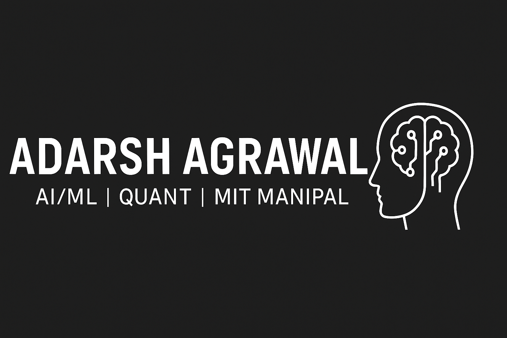

<h1 align="center">
   
  Hi, I'm Adarsh Agrawal
</h1>

🎓 **Third-year B.Tech Student @ MIT Manipal**  
💡 Passionate about **AI/ML**, **Data Structures & Algorithms**, and **Competitive Programming**  
🚀 Aspiring **Data Scientist / Quant Engineer**, aiming for top tech and finance companies *(FAANG & beyond)*  

---

## 🛠️ Skills
- **Programming Languages:** Python, C, C++, C#, Java, PHP, JavaScript, HTML, CSS, SQL, Shell  
- **Databases:** MySQL, MongoDB  
- **Frameworks & Libraries:** TensorFlow, PyTorch, Scikit-learn, Pandas, NumPy  
- **Tools & Platforms:** Git, GitHub, VS Code, Linux, Jupyter Notebook  
- **Core Interests:** Artificial Intelligence, Machine Learning, Data Analysis, Competitive Programming

---

## 📂 Featured Projects
- 🩺 [**Heart Disease Prediction**](https://github.com/adars-h-agrawal/heart-disease-prediction)  
  → Machine Learning project predicting heart disease using the **KNN algorithm** and patient dataset analytics.

- 🔢 [**Digit Recognition (CNN Model)**](https://github.com/adars-h-agrawal/digit-recognition-cnn-model)  
  → A **Deep Learning project** using Convolutional Neural Networks (CNNs) to classify handwritten digits (MNIST dataset) with TensorFlow/Keras.

- 🍽️ [**Restaurant Management System**](https://github.com/adars-h-agrawal/resturant-management-system)  
  → A **C# + SQL Server** desktop application to streamline restaurant operations, billing, and inventory.

- 🏨 [**Hostel Management System**](https://github.com/adars-h-agrawal/hostel-management-system)  
  → A **PHP + MySQL + HTML/CSS/JS** full-stack web application for managing student data, fees, and maintenance records.

- 🔐 [**Advanced Network Intrusion Detection System (NIDS)**](https://github.com/adars-h-agrawal/advanced-network-intrusion-detection)  
  → A hybrid **AI-based security system** detecting potential cyber threats using machine learning and network packet analysis.

🚧 *More projects coming soon — including Stock Market Analysis, CNN Traffic Detection & AI Agent*  

---

## 💻 Languages & Tools

---

## 👨‍💻 Tech Stack Icons

 
 
 
 
 
 
 
 
 
 
 
 
 
 
 

---

## 🏆 LeetCode Stats

---

## 📊 GitHub Stats
  

---

## 📫 Connect with Me
- 💼 [LinkedIn](https://www.linkedin.com/in/adarsh-agrawal-76665a222/)  
- 📧 [Email](mailto:agrawaladarsh2005@gmail.com)  

---

> *“Live today so fully, so boldly, that if it were your last, you'd leave with no regrets—only peace in your heart and purpose in your wake.”* ✨
